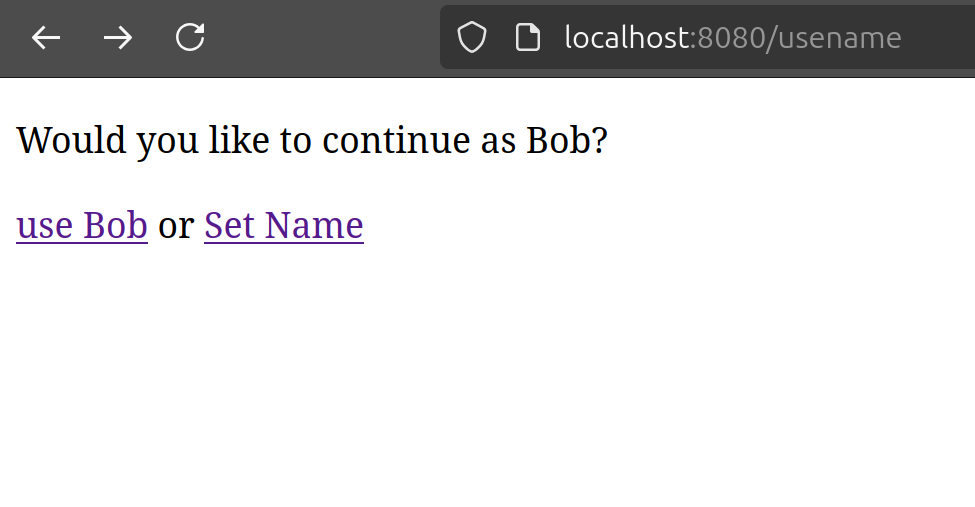
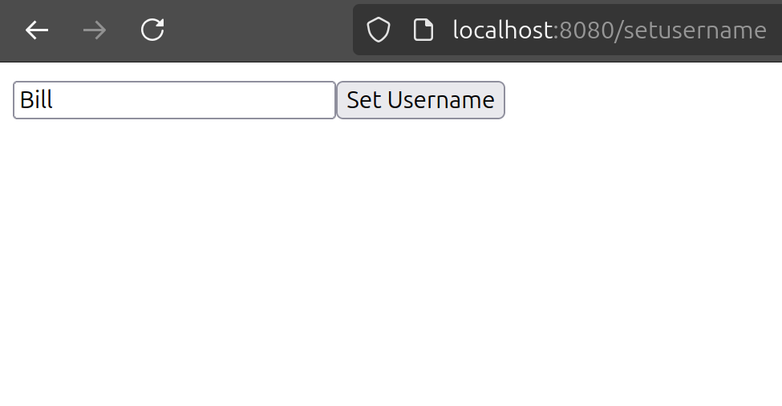
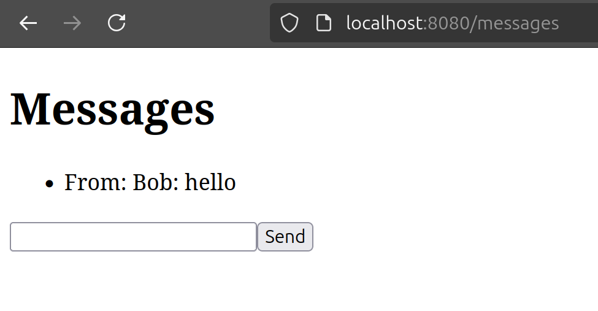

# Local Chat

Chat room that runs a server on a localy.
The server is programmed in Node.js and the database is in Mongodb.

## Get Started
Download and install NPM and MongoDB and start MongoDB localy\
Install all the node dependencies:
```
npm install
```
Start the server:
```
npm start
```
Open `http://localhost:8080` in your browser
## Screenshots


